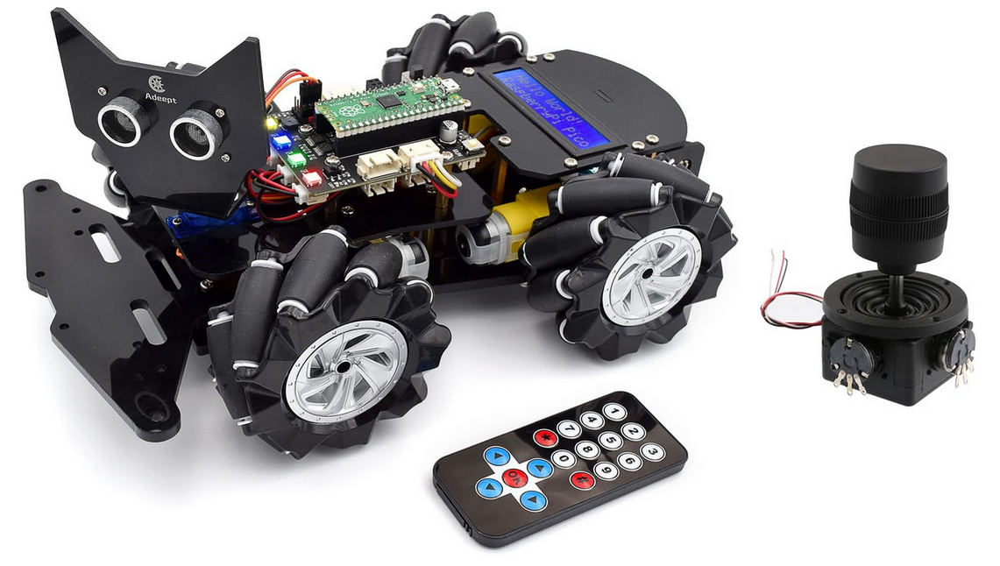
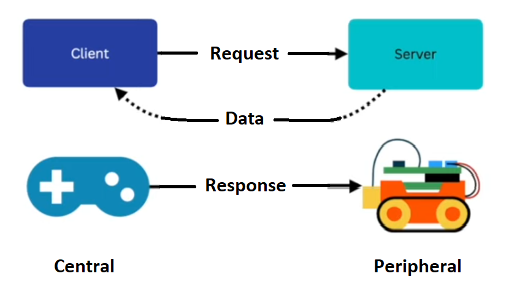
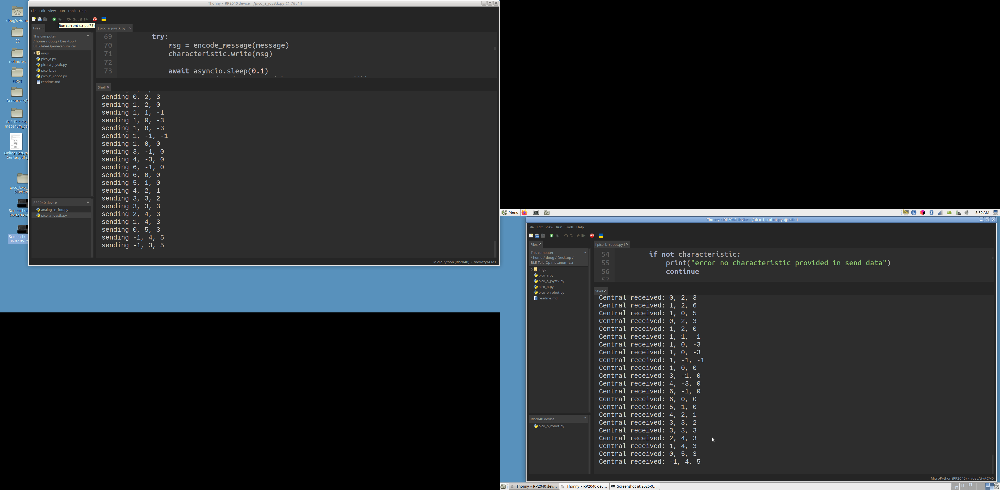

# Replace IR remote control [Adeept Mecanum Wheel Robotic Car](https://www.amazon.com/Adeept-Omni-Directional-Raspberry-Controlled-Educational/dp/B0BF5GVJK8?ref_=ast_sto_dp) with [3-axis Joystick](https://a.co/d/4GYH1ec) control.



## Why replace the push-button IR remote with a Joystick?
* With the push-button IR remote controller, the robot car is only capable of moving in a single direction at a time.
    * For example, the robot can move forward / backward **or** right / left **or** spin CW / CCW. One at a time.
    * It can't do more than one of these things at the same time.
* With the joystick, it will be capable of much more graceful motion, simultaneously moving in all 3 degrees of freedom.
    * For example, it can move in **any direction** while spinning on its axis, if so directed.
* Pico microcontrollers have built-in BLE communication. Since the Adeept robot car uses a pico, it seems it should be possible to use this built-in BLE to send joystick axis values to it.
    * Let's do some research into how to proceed...

## With a joystick and robot, which is the BLE server (peripheral) and which is the client (central)?

* Here's what Google AI says, when asked: "When sending joystick values in tele-op to a robot using BLE, which is the server and which is the client?"

> Answer:
In a Bluetooth Low Energy (BLE) teleoperation setup where a joystick is used to control a robot, the robot is the server and the joystick (or the device processing the joystick inputs, like a phone or computer) is the client.

> Here's why:

> BLE Server (Robot): The robot acts as the BLE server because it provides services and characteristics that the joystick (client) can interact with. These services would represent the robot's functionality, like movement, arm control, etc. The characteristics within these services would be specific parameters, such as the joystick's X and Y values, button states, etc.

> BLE Client (Joystick/Controller): The joystick, connected to a device acting as the BLE client, initiates the connection to the robot (server). It reads and writes data to the server's characteristics to send commands (joystick values) and receive data (if applicable). 
Think of it like this:
    The robot "serves up" its capabilities as defined by its BLE services and characteristics.
    The joystick "requests" actions from the robot by interacting with these services and characteristics. 
This client-server model allows the joystick to send commands to the robot in real-time for teleoperation.

## Now, let's research some familiar examples:
* I almost forgot, but not long ago, I took some notes on [Learning BLE on Pico](/home/doug/Desktop/md-notes/bluetooth_on_pico/notes.md) that are worth reviewing again.
* In [this recent project](https://github.com/dblanding/Picobot_joy_HC-05), I had a 2-axis joystick sending values between 2 Picos using HC-05/06 modules. By the way, I used 2 Thonny windows side by side as I developed the code for the remote control and robot.
    * With the HC-05 / 06 modules, I don't think it mattered which was the server and which was the client. They were just paired.
* [An earlier project](https://github.com/dblanding/teleOpOmniCar) (using Arduino code) shows the 3-axis joystick Tele-Operating an Omni-Wheeled mobile robot. It also uses the HC-05/06 modules for Bluetooth communication.
    * The Pico has 3 analog input channels, so it will be able to accept input from all 3 joystick axes.
* I also built this [PicoBot_BLE_TelOp project](https://github.com/dblanding/PicoBot_BLE_TeleOp/blob/main/README.md) (which was based on Kevin McAleer's [Bluetooth remote controlled robot tutorial](https://www.kevsrobots.com/blog/bluetooth-remote.html). Kevin didn't place a lot of emphasis on which was the server and which was the client, but looking at the code, it can be seen that the *server advertises* and the *client scans*.
    * The project used a push-button remote which was the BLE server while the robot was the client. This is the **opposite** of the advice I got from Google AI.
* More recently, Kevin McAleer produced another online tutorial showing [How to set up two-way Bluetooth communication between two Raspberry Pi Picos](https://www.kevsrobots.com/blog/two-way-bluetooth.html).  I wonder if I could use his code as a template for this project.
    * This graphic (adapted from Kevin's tutorial) shows how messages flow between client and server when communicating in BLE.



* Kevin makes a point of setting his robot up as the server, showing a controller as a client.
* His tutorial uses 2 (almost identical) scripts: `pico_a.py` and `pico_b.py`, the only difference being that one declares itself to be the *Central* (client) and the other is the *Peripheral* (server).
* I got `pico_a.py` and `pico_b.py` running simultaneously in 2 Thonny windows.

Here is some output from pico_a.py (Central):
```
Connecting to Peripheral
Central received: Hello from Peripheral!, count: 0
Central received: Hello from Peripheral!, count: 1
Central received: Hello from Peripheral!, count: 2
Central received: Hello from Peripheral!, count: 3
Central received: Hello from Peripheral!, count: 4
Central received: Got it, count: 5
Central received: Got it, count: 6
Central received: Hello from Peripheral!, count: 7
Central received: Hello from Peripheral!, count: 8
Central received: Hello from Peripheral!, count: 9
Central received: Hello from Peripheral!, count: 10
Central received: Got it, count: 11
Central received: Hello from Peripheral!, count: 12
Central received: Hello from Peripheral!, count: 13
Central received: Hello from Peripheral!, count: 14
Central received: Hello from Peripheral!, count: 15
Central received: Hello from Peripheral!, count: 16
Central received: Got it, count: 17
Central received: Hello from Peripheral!, count: 18
Central received: Hello from Peripheral!, count: 19
Central received: Hello from Peripheral!, count: 20
Central received: Hello from Peripheral!, count: 21
```
And here is the output from pico_b.py (Peripheral):
```
Peripheral starting to advertise
sending Hello from Peripheral! 0
Peripheral sent: Hello from Peripheral! 0, response Hello from Peripheral! 0
sending Hello from Peripheral! 1
Peripheral sent: Hello from Peripheral! 1, response Hello from Peripheral! 1
sending Hello from Peripheral! 2
Peripheral sent: Hello from Peripheral! 2, response Hello from Peripheral! 2
sending Hello from Peripheral! 3
Peripheral sent: Hello from Peripheral! 3, response Got it
sending Hello from Peripheral! 4
Peripheral sent: Hello from Peripheral! 4, response Got it
sending Hello from Peripheral! 5
Peripheral sent: Hello from Peripheral! 5, response Got it
sending Hello from Peripheral! 6
Peripheral sent: Hello from Peripheral! 6, response Hello from Peripheral! 6

<some lines not shown>

Peripheral sent: Hello from Peripheral! 12, response Hello from Peripheral! 12
sending Hello from Peripheral! 13
Peripheral sent: Hello from Peripheral! 13, response Got it
sending Hello from Peripheral! 14
Peripheral sent: Hello from Peripheral! 14, response Got it
sending Hello from Peripheral! 15
Peripheral sent: Hello from Peripheral! 15, response Hello from Peripheral! 15
sending Hello from Peripheral! 16
Peripheral sent: Hello from Peripheral! 16, response Hello from Peripheral! 16
sending Hello from Peripheral! 17
Peripheral sent: Hello from Peripheral! 17, response Hello from Peripheral! 17
sending Hello from Peripheral! 18
Peripheral sent: Hello from Peripheral! 18, response Got it
```
* The values on these two screens were captured with a single photo, so they are simultaneous.
* How is the client able to have already received count = 21, when the server has only managed to send up to 18? It looks like there may be some latency issues.
* Moreover, these scripts aren't really clarifying what is going on relative to my goal, which is to send joystk axis values from client to server as a *request*.
* The client script is only telling me what it has received. That's not helpful.
* The server only tells us what it is sending. Again, who cares?
* We occasionally see a "Got it". Is that a response?
    * If it is a response, isn't the server supposed to receive that? Why is it being received by the client?

### Summarizing the problem:
* In Kevin's [tutorial](https://www.kevsrobots.com/blog/two-way-bluetooth.html), Step 3 Sending and receiving data, he says:
    * The Central sends messages to the peripheral and
    * The Peripheral receives messages and can respond.
* But in the [Github code](https://github.com/kevinmcaleer/pico_two_way_bluetooth), which I'm running:
    * The run_central_mode() coroutine launches the receive_data_task and
    * The run_peripheral_mode() coroutine launches the send_data_task
* Looking at the actual output:
    * The central device (pico_a), all lines are `Central received:`
    * The peripheral device (pico_b), all lines are about `sending`

* If I follow Kevin's advice and set my robot as the peripheral device, I will need to hook up the joystick to the Pico Central device (`pico_a.py`) so that it can send a tuple of the joystick values (x, y, z) to the Pico Peripheral device (`pico_b.py`).
    * It sounds counter-intuitive to me, but according to the diagram above, the (x, y, z) tuple of values would be the *request*. (Sending a tuple is *cruder* that what Google AI suggests, but it might be a workable starting point. I can always come back and clean it up later.)
        * According to the protocol, the robot would then reply by sending the requested *data* back to the Central. In my case, I am not really asking for any data. A simple acknowledgement would do nicely.
        * Finally, the client could send a *response* back to the robot. Definitely not needed here.

### The path forward:
* Stop trying to get the Client to send joystick data to the Server
* Instead, let the joystick be the server and the robot be the client
    * Joystick is still connected to pico_a, but role is changed to *Peripheral*
    * Change pico_b role to *Central*



